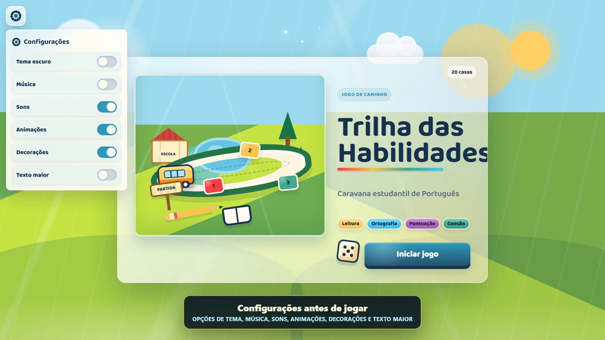
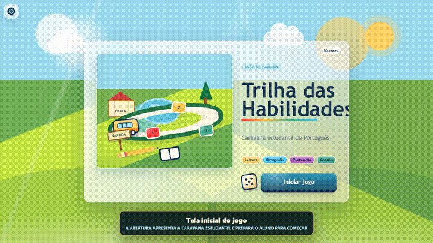

# Jogos de Língua Portuguesa



Repositório com dois jogos independentes de Língua Portuguesa. Eles ficam no mesmo repositório apenas para facilitar a entrega, mas cada jogo abre em sua própria pasta e funciona separado do outro.

🌐 **Link online:** [allansousa00.github.io/jogo-eduardo](https://allansousa00.github.io/jogo-eduardo/)

Links diretos:

- [Trilha das Habilidades](https://allansousa00.github.io/jogo-eduardo/Trilha-das-Habilidades/)
- [Quiz Português](https://allansousa00.github.io/jogo-eduardo/Quiz-Portugues/)

🎬 **Demonstração:** [vídeo da Trilha das Habilidades](docs/media/demonstracao-trilha-das-habilidades.mp4)



## Projetos

| Projeto | Caminho | Para que serve |
| --- | --- | --- |
| Quiz Português | `Quiz-Portugues/` | Revisão rápida com perguntas, feedback, modo professor e resultado final |
| Trilha das Habilidades | `Trilha-das-Habilidades/` | Jogo de caminho com dado 3D, caravana, perguntas por casa e tema claro/escuro |

## Como abrir

Abra o arquivo `index.html` do projeto desejado:

```text
Quiz-Portugues/index.html
Trilha-das-Habilidades/index.html
```

Também é possível abrir pela página inicial do repositório:

```text
index.html
```

## Trilha Das Habilidades

Na trilha, o aluno joga o dado, a caravana anda pelo caminho e uma pergunta aparece automaticamente na casa em que ele parou. Se acertar, fica na casa. Se errar, volta para a posição anterior.

Recursos principais:

- dado 3D com animação;
- tema claro e tema escuro com decorações diferentes;
- modo alto contraste, texto maior, reduzir movimento e tela cheia;
- atalhos de teclado para projetor e sala de aula;
- perguntas de múltipla escolha, verdadeiro/falso, completar lacuna e associação;
- banco com 5 perguntas por habilidade;
- resumo final por habilidade;
- validação automática do banco de perguntas.

## Quiz Português

O quiz é mais direto: o aluno responde perguntas, recebe feedback e acompanha o desempenho. O modo professor permite importar/exportar perguntas em JSON.

Recursos principais:

- perguntas embaralhadas;
- feedback com explicação;
- revisão dos erros;
- progresso salvo no navegador;
- tema claro/escuro;
- modo professor.

## Como apresentar em sala

1. Abra o jogo em tela cheia.
2. Use projetor ou TV.
3. Divida a turma em equipes ou deixe a turma responder em conjunto.
4. Use o dado para criar suspense e manter a participação.
5. Ao final, veja o resumo por habilidade para retomar os conteúdos com mais erro.

Atalhos úteis da Trilha:

| Tecla | Ação |
| --- | --- |
| `Espaço` ou `D` | Jogar o dado |
| `1`, `2`, `3`, `4` | Responder alternativa no modal |
| `R` | Reiniciar |
| `T` | Trocar tema |
| `F` | Tela cheia |
| `M` | Silenciar tudo |
| `Esc` | Fechar painel ou tela final |

## Como editar perguntas

Na Trilha, as perguntas ficam em:

```text
Trilha-das-Habilidades/data.js
```

Cada pergunta segue este formato:

```js
{
  skill: "Ortografia",
  type: "fill-blank",
  difficulty: "facil",
  prompt: "Complete: O aluno fez uma boa ___.",
  options: ["pesquiza", "pesquisa", "pezquisa", "pesquissa"],
  answer: 1,
  explanation: "A forma correta é pesquisa."
}
```

Tipos aceitos:

- `multiple-choice`: múltipla escolha;
- `true-false`: verdadeiro ou falso;
- `fill-blank`: completar lacuna;
- `association`: associação.

Depois de editar, rode:

```bash
node tools/check-project.js
```

## Estrutura

```text
Plataforma-Lingua-Portuguesa/
├── Quiz-Portugues/
├── Trilha-das-Habilidades/
│   ├── data.js
│   ├── index.html
│   ├── script.js
│   └── style.css
├── docs/
│   ├── CHECKLIST-QA.md
│   └── media/
├── tools/
│   ├── check-project.js
│   └── validate-trilha-data.js
├── index.html
├── CHANGELOG.md
├── LICENSE
└── README.md
```

## Perguntas frequentes

**Precisa de internet?**
Não para rodar localmente. Só precisa de internet para abrir pelo GitHub Pages.

**Funciona no celular?**
Sim. A Trilha se adapta melhor em tablets e telas maiores, mas também tem ajustes para celular.

**Dá para usar em projetor?**
Sim. Use o botão de tela cheia ou a tecla `F`.

**As configurações ficam salvas?**
Sim. Tema, som, texto maior e acessibilidade ficam salvos no navegador.

**Posso colocar mais perguntas?**
Pode. Edite `Trilha-das-Habilidades/data.js` e valide com `node tools/check-project.js`.

## Qualidade

Comando principal:

```bash
node tools/check-project.js
```

Ele confere sintaxe JavaScript e valida o banco de perguntas da trilha.

Checklist manual:

```text
docs/CHECKLIST-QA.md
```

Se o computador tiver `npm` instalado, também pode usar `npm run check`.

## Publicação

O projeto está preparado para GitHub Pages por workflow em `.github/workflows/pages.yml`.

Repositório remoto:

```text
git@github.com:AllanSousa00/jogo-eduardo.git
```

URL esperada após o deploy:

```text
https://allansousa00.github.io/jogo-eduardo/
```
